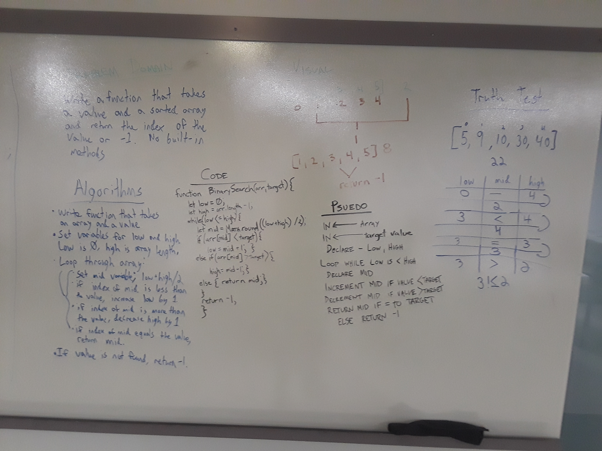
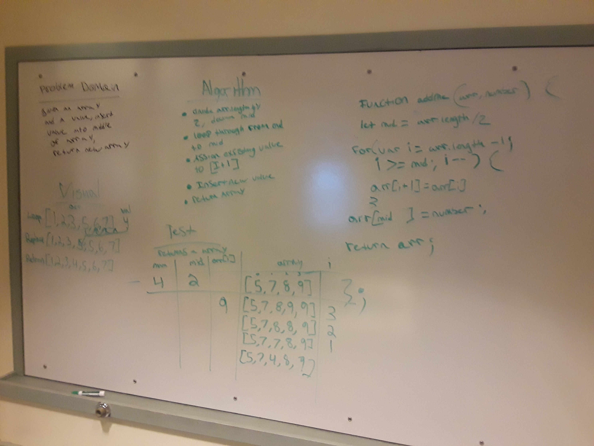
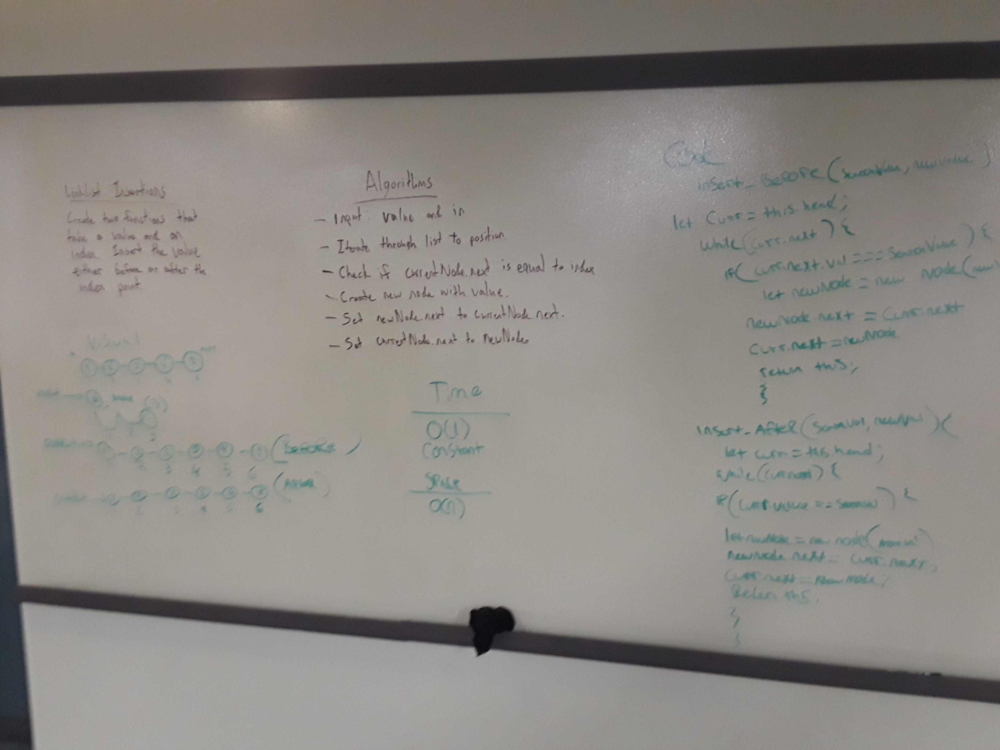
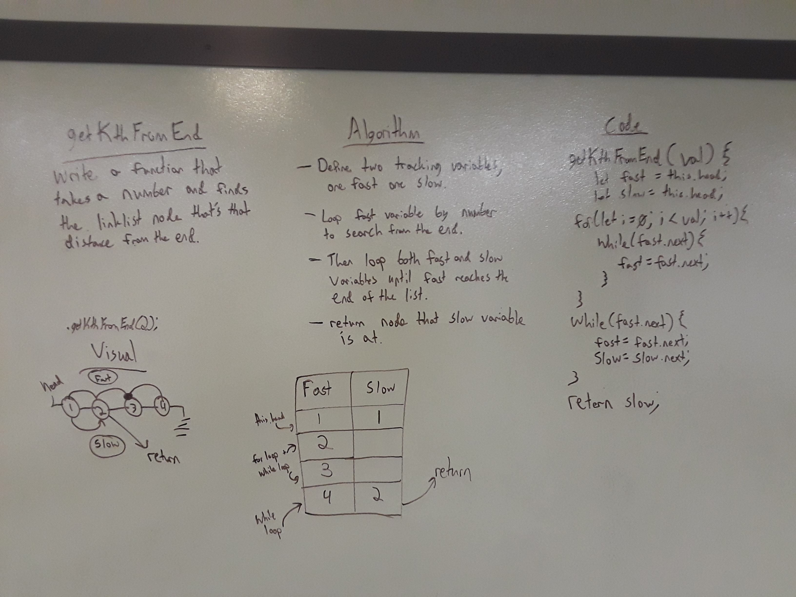
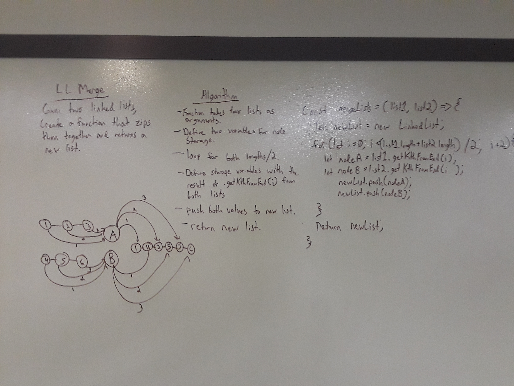

# Data Structures and Algorithms Exercises
This is a collection of exercises and code challenges focusing on data structures and algorithms.

<!-- ## Contents

Arrays
Linked Lists
Stacks and Queues
Binary Trees -->

# Arrays

### Reverse Array
Given an input array, build a function to return the array with all elements in reverse order.  No built-in language methods may be used.
#### Whiteboard

### Array Binary Search
Make a function that takes in a sorted array and a value.  Perform a binary search to find the value in the array and return the index position.  Return -1 if the value is not in the array.  No pre-built methods may be used.
#### Whiteboard

### Array Shift
Make a function that takes in an array and a number, and inserts the number into the middle of the array.  Do not use any built-in array methods.
#### Whiteboard

# Linked Lists

### Singly Linked List (SLL)
Create a Linked List that incorporates nodes that hold a value and a pointer to their next node. 
#### Methods
- `append(value)`
  Takes in a value, creates a node and adds it to the end of the list.
- `prepend(value)`
  Takes in a value, creates a node and add it to the front of the list, replacing the head.
- `reverse()`
  Reverses the location of all nodes on the list.  The head is now at the very end, etc.
- `remove(offset)`
  Moves forward through the list `offset` times, and removes that item from the list.
  Returns the node that was just removed.
- `getMiddle()`
  Searches for the node in the middle of the list and returns it.  Does not delete the node. 
- `insertBefore(number, value)`
  Moves forward through the list one before `number` of positions and inserts a new node with `value` into the list, then returns the list.
- `insertAfter(number, value)`
  Moves forward through the list `number` of positions and inserts a new node with `value` into the list, the returns the list.
  Rounds up if there is an odd number of nodes in the list.
- `getKthFromEnd(number)`
  Moves backwards through the list `number` places and returns the node at that location.
- `serialize()`
  Creates an array with each node object in the list taking a position in the array.
#### Linked List Insertions Whiteboard

### getKthFromEnd() Whiteboard

### Linked List Merge
- `mergelists(list1, list2)`
  This is a funtion that takes two equal length linked lists and creates a new list with their nodes' values, taking one from list1, then one from list2.  The new list will alternate between the node values of the old lists.
#### Whiteboard

## Doubly Linked List (DLL)
This operates identically as a SLL, except each node also has a `prev` property pointing to the previous node in the list.
It retains the `value` and `next` properties.
### Implemented methods
- `append(value)`
  Takes in `value` and adds it to the end of the list.
- `prepend(value)`
  Takes in `value` and adds it to the front of the list.  
  This new node will be the new `head` and it's `next` will point to the old one.
- `reverse()`
  Reverses the position of every node.
- `remove(offset)`
  Moves forward `offset` places and removes that node from the list.
  Returns the node that was just removed.
- `serialize()`
  Transposes the properties of each node object ionto individual positions of an array.
  Returns the array.

## Deserialize
Both types of lists have access to an externalized `deserialize(array)` funtion.  This function takes in an array created by either lists' `.serialize()` function, and returns a new list created from the array.

# Stacks and Queues

### Create a Stack and a Queue
Create a Stack that serves data on a first-in-last-out basis, and a Queue that serves data on a first-in-first-out basis.
#### Stack Methods
##### push(value)
Creates a new node with the given value and adds it to the top of the stack.
##### pop()
Removes the top node from the stack and returns it.
##### peek()
Returns the the top node in the stack but doesnt remove it.
#### Queue Methods
##### enqueue(value)
Creates a new node with the given value and addis it to the back of the queue.
##### dequeue()
Returns the node at the front of the queue.
##### peek()
Show the next node to come out of the queue, but doesn't remove it.

### Queue With Stacks
Create a pseudoqueue, which functions just like a queue, but uses two stacks and no actual queue.
#### Pseudoqueue Methods
##### enqueue(value)
Creates a new node with the given value and adds it to stack1.
##### dequeue()
Iterate through, popping a node off stack1 and pushing it onto stack2, then pop one off stack 2 and hold the value in an output variable.  Iterate again, popping off stack2, pushing onto stack1, finally return the output variable.
##### peek()
Returns the next item to come off the qseudoqueue, but doesn't remove it.
#### Whiteboard

